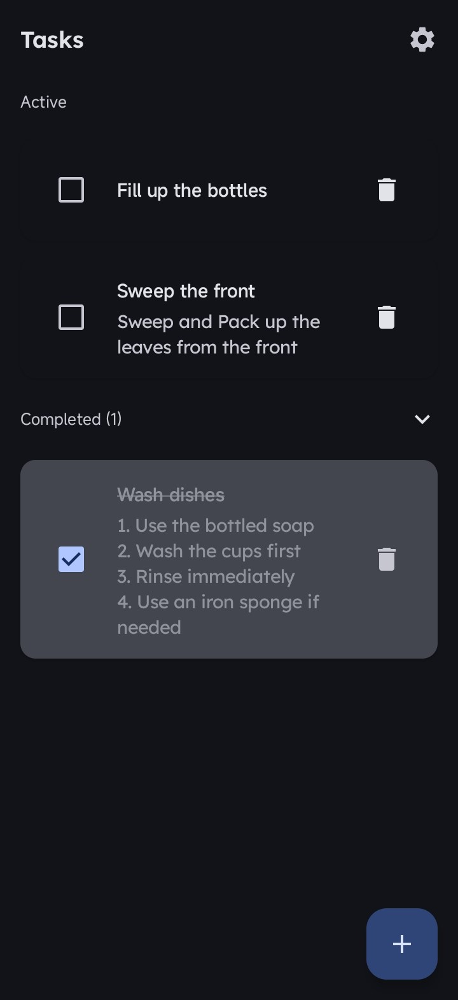
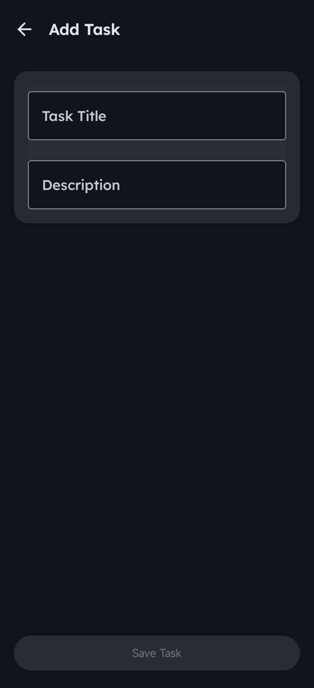
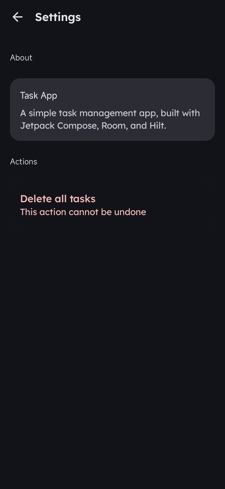
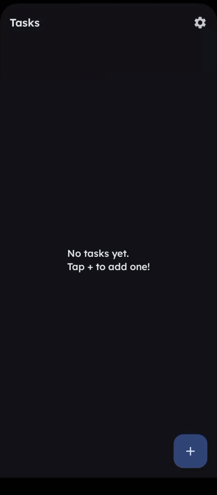

# Task App

git  This project demonstrates production-level Android architecture, focusing on unidirectional data flow, reactive UI design, and scalable state management.

---

## Features

* View a list of tasks
* Add new tasks
* Edit existing tasks
* Mark tasks as completed
* Delete individual tasks
* Delete all tasks from Settings
* Persistent local storage using Room (SQLite)
* Reactive UI updates using Kotlin Flow
* Type-safe navigation using Kotlin Serialization (no string-based routes)
* Navigation between multiple screens
* Confirmation dialog for destructive actions
* One-time navigation effects using SharedFlow

---

## Screens

### Task List Screen

Displays all saved tasks in a scrollable list.

Each task item includes:

* Task title
* Completion status
* Delete button

The UI automatically reacts to database updates using Flow.

---

### Add / Edit Task Screen

Supports both creating and updating tasks.

Key behaviors:

* Save button is **enabled only when input is valid or changes are made**
* Tracks changes against original task state when editing
* Supports marking tasks as completed
* Uses a single screen for both add and edit flows
* Automatically navigates back after saving via one-time effects

---

### Settings Screen

Provides application-level actions.

Current functionality:

* Delete all tasks
* Confirmation dialog before destructive action
* After confirmation, all tasks are deleted and the app **automatically navigates back to the Task List screen**
* Navigation is handled via one-time side effects (SharedFlow)

---

## Preview

A quick look at the app in action:

| Task List                                                                            | Add / Edit                                                                           | Settings                                                                           |
|--------------------------------------------------------------------------------------|--------------------------------------------------------------------------------------|------------------------------------------------------------------------------------|
|  |  |  |



---

## Architecture

This application follows a **unidirectional data flow** approach within the **MVVM (Model–View–ViewModel)** architecture.

```
UI (Compose Screens)
        ↓
State (StateFlow)
        ↓
ViewModel (Business Logic)
        ↓
Repository
        ↓
DAO (Room)
        ↓
Database (SQLite)
```

UI state is collected in a lifecycle-aware manner to prevent unnecessary recompositions and leaks.

---

## Key Design Decisions

* **Single source of truth (StateFlow)** for UI state
* **Immutable UI state** using data classes and copy()
* **Derived state** (e.g. `isSaveEnabled`) instead of manual flags
* **SharedFlow for one-off effects** (navigation, events)
* **Type-safe navigation using Kotlin Serialization** instead of string routes
* **Lifecycle-aware state collection** using `collectAsStateWithLifecycle`
* **viewModelScope + coroutines** for safe, structured concurrency
* **Repository pattern** for data abstraction
* **Mapper layer** for clean separation between database and domain
* **Jetpack Compose** for declarative UI
* **Hilt** for dependency injection
* **LazyColumn** for efficient list rendering

---

## Tech Stack

* Kotlin
* Jetpack Compose
* MVVM Architecture
* Room Database
* Hilt Dependency Injection
* Kotlin Coroutines
* Kotlin Flow (StateFlow & SharedFlow)
* Navigation Compose
* Kotlin Serialization (type-safe navigation)
* Material 3

---

## Project Structure
app/src/main/java/com/rogue21/taskapp/

```
data/
    local/
        TaskDao.kt
        TaskDatabase.kt
        TaskEntity.kt

    repository/
        TaskRepository.kt

    mapper/
        TaskMapper.kt

ui/
    screens/
        tasklist/
            TaskListScreen.kt
            TaskListViewModel.kt
        addedit/
            AddEditTaskScreen.kt
            AddEditTaskViewModel.kt
            AddEditTaskEffect.kt
            AddEditTaskUiState.kt
        settings/
            SettingsScreen.kt
            SettingsViewModel.kt
            SettingsEffect.kt
            SettingsUiState.kt

    components/
        TaskItem.kt
        SectionHeader.kt
        
    navigation/
        NavGraph.kt
        Routes.kt

di/
    DatabaseModule.kt

model/
    Task.kt
    
theme/
    Color.kt
    TextFieldDefaults.kt
    Theme.kt
    Type.kt
    
screenshots/ 
    add_edit_screen.jpg
    task_list_screen.jpg
    settings_screen.jpg
    Task_App_Demo.gif
    
TaskApplication.kt
MainActivity.kt
README.md
```

---

## What I Learned

* Applying **unidirectional data flow** in a real-world app
* Managing UI state with **StateFlow** and immutable patterns
* Handling one-time events using **SharedFlow**
* Implementing **type-safe navigation with Kotlin Serialization**
* Writing **lifecycle-aware UI logic** using `collectAsStateWithLifecycle`
* Using **viewModelScope** and coroutines for structured concurrency
* Structuring a scalable **MVVM architecture**
* Separating concerns across UI, domain, and data layers
* Building reactive UIs with **Jetpack Compose**
* Designing reusable and maintainable UI components
* Using **Hilt** for dependency injection
* Implementing **Room** for local persistence

---

## Future Improvements

* Light/Dark mode with persistent user preference (DataStore)
* Task search and filtering (by completion status or keyword)
* Swipe-to-delete with undo (Snackbar)
* Data backup/export functionality
* Optional remote sync (Firebase or REST API)

---

## Author

**Akomolafe Oluwaseyi O.**  
Android Developer

[GitHub Profile](https://github.com/seyi205)
